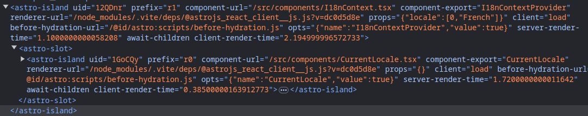

import PublishedAt from "@/components/PublishedAt.astro"

<PublishedAt publishedAt="2024-10-10" />

# Using React Context in Astro

Astro optimizations create some incompatibilities with React Context.
Let's figure how to work around this limitation.

import { OptionalContent} from "@/components/OptionalContent"

<OptionalContent
client:load
title="Not familiar with context in React yet?"
>

## Context in React: why we need them

In React, we pass data from a parent component to its children using "props".

This may become tedious 
if the component that renders the data is deeply nested in the component tree.
We call this problem "props drilling".

```tsx
function Parent() {
  const data = "parent data";
  return <Child data={data} />;
}
// props drilling:
// Child doesn't use data,
// it just passes them to GrandChild
function Child({ data }) {
  return <GrandChild data={data} />;
}
function GrandChild({ data }) {
  return <div>{data}</div>
}
```

Context allows passing data from a parent component to its grand-children or below
without having to pass the data through intermediate components.

A Context Provider defines a context,
and the `useContext` hook can consume this context.

```tsx
import { createContext, useState, useContext } from "react";

const MyContext = createContext();

// Providing a context value
// to all components below MyProvider
function MyProvider({ children }) {
  const [data, setData] = useState("provider data");
  return (
    <MyContext.Provider value={data}>
      {children}
    </MyContext.Provider>
  )
}
// Consume a context value,
// using "useContext"
function MyConsumer() {
  const data = useContext(MyContext);
  return <div>{data}</div>;
}
```

The example before becomes:
```tsx
function Parent() {
  const data = "parent data";
  return (
    <MyProvider data={data}>
      <Child />
    </MyProvider>
  )
}
// no more props drilling!
function Child() {
  return <GrandChild />;
}
function GrandChild({ data }) {
  const data = useContext(MyContext)
  return <div>{data}</div>
}
```

</OptionalContent>

## Islands in Astro

Astro introduces a concept of "islands of interactivity".
The plural matters : one page may contain multiple islands.

This means that your React components are not automatically interconnected.
A child component may not be able to comunicate with a parent context.

In the interactive example and in the code snippet below, 
the `CurrentLocale` component
won't be able to read a context set by `I18nContextProvider`!

At best, `CurrentLocale` can display the default context value,
but it will never be initialized with the context provider value
and won't receive any update.


```astro
// index.astro
import { MyContext } from "./ParentContext"
import { Myconsumer } from "./Child"
---
{/** These will be separate islands! */}
<I18nContextProvider client:load locale="French">
    {/** Won't be able to access the data {foo: "bar"} at all */}
    <CurrentLocale client:load />
<I18nContextProvider/>
```
If we observe the generated elements in the browser's DevTools,
we notice that Astro created not one but two islands,
and the React context is lost between them.



:::info
If you don't use the [`client:load` directive](https://docs.astro.build/fr/reference/directives-reference/#clientload),
Astro won't even run these components JavaScript code in the browser (what we call "hydrating").
:::


## The Australian architecture : a massive island 🏝️

If your Astro app is very interactive
and uses React code everywhere,
you might consider making it a single, big React island.

It's possible to use React Context within such an island.

```
// MyReactApp.tsx
// This whole component is a single island
import { ParentContext } from "./ParentContext"
import { GrandChild } from "./GrandChild"
export function MyReactApp() {
    return (
        <ParentContext>
          <Child />
        <ParentContext/>
    )
```

:::info
This architecture is similar to how Next.js App Router works,
with a single React instance instead of multiple separate islands.
:::

## 🔨 Practice: React context with a single island

import SkipPractice from "@/components/SkipPractice.mdx"

<SkipPractice />

- Create a component `MyApp.tsx`
- Move the `I18nContextProvider` and `CurrentLocale` components from `index.astro` to `MyApp.tsx`
- Remove the `client:load` directives from `I18nContextProvider` and `CurrentLocale`
- Render `<MyApp client:load />` in `index.astro`
- You are done! 🎉

With this approach, you shift away from Astro mental model
to build a React "Single Page Application" (SPA) with a more traditional architecture.

Whether it's fine or not depends on your own application.
We will learn other ways to handle React Context in Astro in incoming lessons.


import Thanks from "@/components/Thanks.mdx"

<Thanks />

## References

[Passing Data Deeply with Context - React docs](https://react.dev/learn/passing-data-deeply-with-context)

[Share state between Islands - Astro docs](https://docs.astro.build/en/recipes/sharing-state-islands/)

[Make UI framework contexts available between islands](https://github.com/withastro/roadmap/discussions/742)

## Stay informed

import { SubscribeForm } from "@/components/SubscribeForm"

AstroPatterns is under active development, enter your email to be informed when new patterns are out.

<SubscribeForm client:load />

import BetaBanner from "@/components/BetaBanner.mdx"

<BetaBanner />